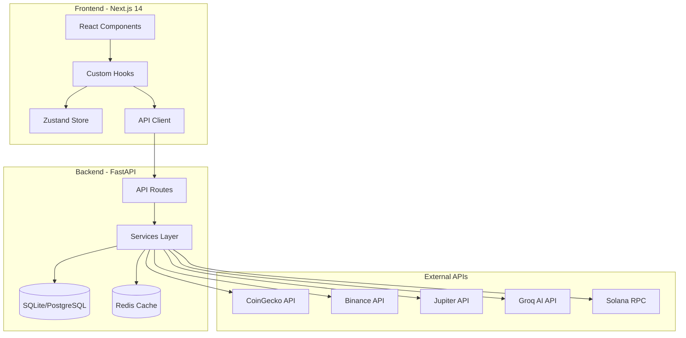

# Solana Meme Coin Trading Bot - Project Completion Plan

## 📋 Executive Summary

Based on a comprehensive end-to-end review, the project is **substantially complete** with all core features implemented. The documentation in `LEFTOVER_WORK.md` indicates 12 major features are complete. However, there are several areas that need attention for full production readiness.

---

## 🔍 Current State Analysis

### ✅ Completed Features

| Feature | Status | Notes |
|---------|--------|-------|
| Frontend Dashboard | ✅ Complete | AI-powered trading interface with React/Next.js 14 |
| Backend API | ✅ Complete | FastAPI with 25+ endpoints |
| Token Data Service | ✅ Complete | CoinGecko + Binance integration |
| AI Analysis | ✅ Complete | Groq LLM integration with fallback |
| Paper Trading | ✅ Complete | $10,000 virtual trading |
| Portfolio Management | ✅ Complete | Holdings, P&L tracking |
| Jupiter DEX Integration | ✅ Complete | Swap quotes and transactions |
| Wallet Integration | ✅ Complete | Read-only Phantom wallet support |
| WebSocket Support | ✅ Complete | Real-time price streaming |
| Theme Toggle | ✅ Complete | Dark/Light mode |
| CI/CD Pipeline | ✅ Complete | GitHub Actions workflow |
| Docker Configuration | ✅ Complete | Development and production configs |

### ⚠️ Issues Identified

| Issue | Severity | Description |
|-------|----------|-------------|
| Missing Mock Data Files | Medium | `frontend/public/mock/` directory is empty but referenced in docs |
| E2E Test File Naming | Low | Files use different naming than documented in LEFTOVER_WORK.md |
| PostgreSQL Migration | Low | Documented but not tested in production |
| Alert System | Low | Email/Telegram configured but requires API keys |
| SSL Certificates | Low | nginx/ssl directory not present for HTTPS |

---

## 📝 Remaining Tasks

### Category 1: Missing Files to Create

#### 1.1 Mock Data Files (frontend/public/mock/)

The LEFTOVER_WORK.md mentions mock JSON files but the directory is empty. Create these files for offline/demo mode:

**Files to create:**
- `frontend/public/mock/tokens.json` - Mock token list
- `frontend/public/mock/ohlcv.json` - Mock OHLCV chart data  
- `frontend/public/mock/analysis.json` - Mock AI analysis responses

#### 1.2 SSL Certificates Directory

For production HTTPS support:
- Create `nginx/ssl/` directory
- Add placeholder/instructions for certificate setup

---

### Category 2: Testing & Verification

#### 2.1 Backend Tests
Run and verify all backend tests pass:
```bash
cd backend
pip install -r requirements.txt
pytest tests/ -v
```

**Known issues from docs:**
- 98 passed, 3 skipped, 2 failed (pre-existing)

#### 2.2 Frontend Build
Verify frontend builds without errors:
```bash
cd frontend
npm install
npm run build
npm run type-check
```

#### 2.3 E2E Tests
Verify Playwright tests work:
```bash
cd frontend
npx playwright install
npm run test:e2e
```

**Note:** E2E test files exist:
- `home.spec.ts`
- `portfolio.spec.ts`
- `token-detail.spec.ts`
- `trading.spec.ts`

---

### Category 3: Integration Testing

#### 3.1 API Endpoint Testing
Manually verify all endpoints work:

```bash
# Health check
curl http://localhost:8000/health

# Get tokens
curl http://localhost:8000/api/tokens

# Get OHLCV
curl http://localhost:8000/api/tokens/BONK/ohlcv

# Get portfolio
curl http://localhost:8000/api/portfolio

# AI Analysis
curl -X POST http://localhost:8000/api/analysis \
  -H "Content-Type: application/json" \
  -d '{"symbol": "BONK"}'
```

#### 3.2 Frontend-Backend Integration
1. Start backend: `cd backend && uvicorn app.main:app --reload`
2. Start frontend: `cd frontend && npm run dev`
3. Verify:
   - Token list loads from API
   - Charts display correctly
   - AI analysis works
   - Paper trading executes
   - Portfolio updates

---

### Category 4: Docker Deployment

#### 4.1 Development Mode
```bash
docker-compose -f docker-compose.yml -f docker-compose.dev.yml up -d
```

#### 4.2 Production Mode
```bash
docker-compose -f docker-compose.yml -f docker-compose.prod.yml --profile production up -d
```

#### 4.3 Verify Services
- Frontend: http://localhost:3001
- Backend: http://localhost:8000
- Redis: localhost:6379

---

### Category 5: Documentation Updates

#### 5.1 Environment Setup
Ensure `.env.example` files have all required variables:
- [x] Root `.env.example` - Complete
- [x] Backend `.env.example` - Complete
- [x] Frontend `.env.development` - Complete
- [x] Frontend `.env.production` - Complete

#### 5.2 Deployment Guide
Create/update deployment documentation:
- Local development setup
- Docker deployment steps
- Production checklist
- API key requirements

---

## 🎯 Action Items Checklist

### Immediate (Required for Demo)

- [ ] Create mock data files in `frontend/public/mock/`
- [ ] Verify backend tests pass
- [ ] Verify frontend builds without errors
- [ ] Test basic frontend-backend integration

### Short-term (Required for Production)

- [ ] Set up PostgreSQL database
- [ ] Configure Redis for caching
- [ ] Add SSL certificates for HTTPS
- [ ] Configure alert system (Telegram/Email)
- [ ] Set up monitoring/logging

### Nice-to-have (Improvements)

- [ ] Add unit tests for frontend components
- [ ] Implement auto-trading mode
- [ ] Add more meme coins to supported list
- [ ] Create mobile-responsive improvements
- [ ] Add performance optimizations

---

## 🏗️ Architecture Diagram



---

## 📊 Feature Verification Matrix

| Feature | Frontend | Backend | API | Tests | Status |
|---------|----------|---------|-----|-------|--------|
| Token List | ✅ | ✅ | ✅ | ✅ | Ready |
| OHLCV Charts | ✅ | ✅ | ✅ | ✅ | Ready |
| AI Analysis | ✅ | ✅ | ✅ | ✅ | Ready |
| Paper Trading | ✅ | ✅ | ✅ | ✅ | Ready |
| Portfolio | ✅ | ✅ | ✅ | ✅ | Ready |
| Trade History | ✅ | ✅ | ✅ | ✅ | Ready |
| Wallet Connect | ✅ | ✅ | ✅ | ✅ | Ready |
| Jupiter Swap | ✅ | ✅ | ✅ | ✅ | Ready |
| WebSocket | ✅ | ✅ | ✅ | ⚠️ | Needs Testing |
| Alerts | ❌ | ✅ | ✅ | ⚠️ | Config Needed |

---

## 🚀 Quick Start Commands

### Development
```bash
# Terminal 1 - Backend
cd backend
pip install -r requirements.txt
PYTHONPATH=. uvicorn app.main:app --reload --port 8000

# Terminal 2 - Frontend
cd frontend
npm install
npm run dev
```

### Docker
```bash
# Development
docker-compose -f docker-compose.yml -f docker-compose.dev.yml up -d

# Production
docker-compose -f docker-compose.yml -f docker-compose.prod.yml --profile production up -d
```

### Testing
```bash
# Backend
cd backend && pytest tests/ -v

# Frontend
cd frontend && npm run build && npm run type-check

# E2E
cd frontend && npm run test:e2e
```

---

## 📅 Estimated Completion

| Task Category | Complexity | Items |
|---------------|------------|-------|
| Missing Files | Low | 3-4 files |
| Testing/Fixes | Medium | Run tests, fix issues |
| Integration | Medium | Verify all flows |
| Documentation | Low | Minor updates |

**Total estimated items:** ~15-20 action items

---

## ✅ Definition of Done

The project will be considered complete when:

1. ✅ All documented features are implemented
2. ⬜ Mock data files exist for demo mode
3. ⬜ Backend tests pass (98+ passing)
4. ⬜ Frontend builds without errors
5. ⬜ Docker deployment works
6. ⬜ Basic E2E tests pass
7. ⬜ Documentation is up to date
8. ⬜ Environment examples are complete

---

*Last Updated: December 22, 2025*
*Review by: Architect Mode*
